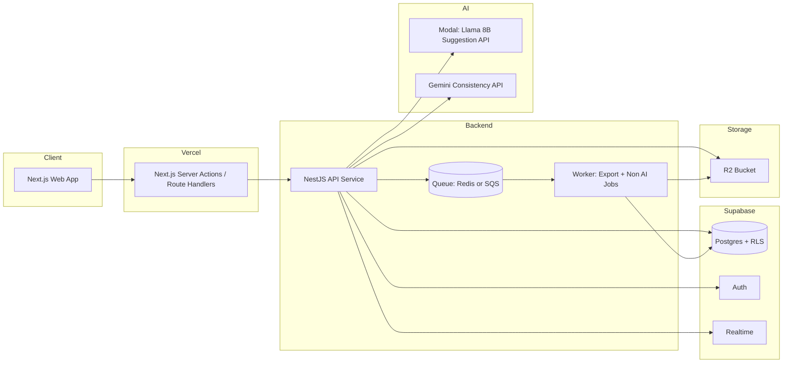
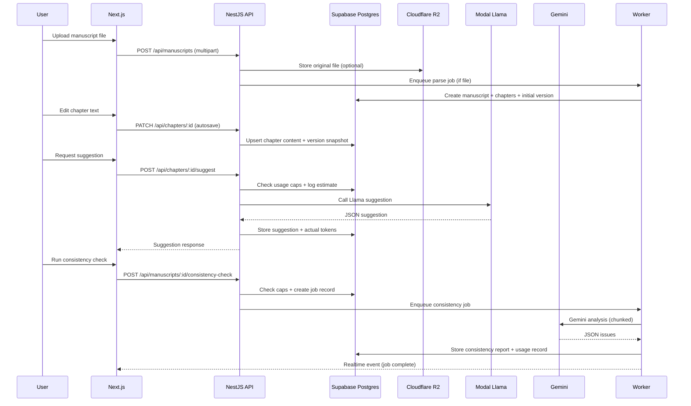
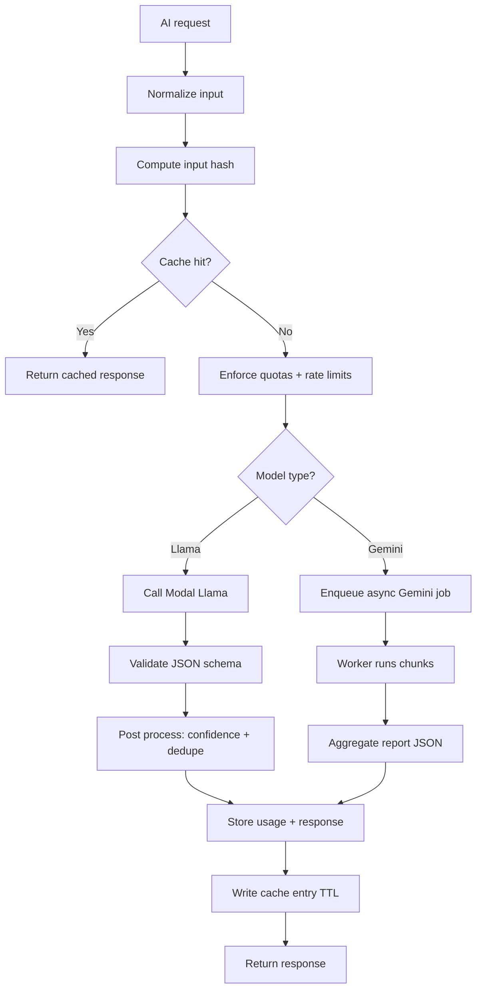

# The Bearing Architecture Document
Owner: Ryan  
Scope: MVP architecture with enforceable AI guardrails, async AI workloads, private-by-default storage, and linear cost scaling.

---

## 0. Architecture goals and non negotiables

From the PRD, these are the constraints that shape every decision:

- Writing and editor workflows never block on AI.
- AI spend is bounded, measurable, enforceable, and tied to revenue.
- Private by default, strong isolation via Supabase RLS.
- Async for heavy tasks (Gemini consistency checks, exports).
- Immutable usage records and audit logs.
- Predictable infra floor around $50 per month at 10 active authors.

Blunt take: if we cut corners on usage metering, RLS, or job orchestration, this product becomes a cost bomb and a privacy risk. Those three are first class architecture pieces, not “later” work.

---

## 1. Tech stack and justification

### 1.1 Frontend: Next.js 14+ on Vercel
**Why**
- SSR and streaming for fast first paint and authenticated gating.
- Built in image optimization for author avatars, exported cover images, etc.
- Route handlers and middleware integrate cleanly with Supabase auth.
- Vercel preview deployments are perfect for an 18 week MVP timeline.

**Key libraries**
- Editor: TipTap or Lexical (recommend TipTap for MVP velocity and ecosystem).
- State and caching: TanStack Query.
- Realtime: Supabase Realtime for support messaging and job updates.

### 1.2 Backend: Node.js with NestJS (recommended)
**Why**
- Strong structure for a product that will grow (modules, DI, guards, interceptors).
- Clean separation between API, jobs, admin operations, and billing usage enforcement.
- Great fit for background worker patterns, queues, and typed DTO validation.

**Alternative**
- FastAPI is fine, but with Supabase + Vercel + Modal, NestJS gives a clean full stack TypeScript story.

### 1.3 Database and Auth: Supabase (PostgreSQL + Auth + RLS)
**Why**
- RLS makes private by default a real guarantee.
- Auth and JWT out of the box.
- Postgres gives reliable relational modeling for manuscripts, chapters, versions, usage, and audit logs.

### 1.4 AI inference
- **Modal.com** hosting a **Llama 8B** endpoint for low latency suggestion calls.
- **Google Gemini API** for deep consistency checks.

**Why**
- Modal handles GPU provisioning, scaling, and async job execution.
- Gemini is strong for long context reasoning and structured outputs for consistency analysis.

### 1.5 File storage: Cloudflare R2
**Why**
- Zero egress, predictable pricing.
- Works well for exports, uploads, and large file artifacts.
- Canonical manuscript content lives in Postgres. R2 is for binaries (uploads, exports, attachments).

### 1.6 Deployment
- Frontend: Vercel
- Backend: AWS ECS (Fargate) or similar managed container service
- Jobs: Modal for AI jobs, plus optional worker containers for exports and parsing.

Recommendation: do not put the entire backend in serverless lambdas if you plan to do queues, long running exports, or admin batch operations. A small ECS service is boring and reliable.

### 1.7 Observability
- Sentry for frontend and backend errors.
- Vercel analytics for web perf.
- Supabase logs for auth and DB errors.
- Modal metrics for GPU endpoints.
- Structured logs (JSON) from the backend.

---

## 2. System architecture diagrams

### 2.1 Component diagram



### 2.2 Data flow: Upload → Parse → Store → Suggest → Consistency → Publish



### 2.3 AI pipeline: Request → Llama/Gemini → Cache → Response



---

## 3. Database schema (PostgreSQL DDL)

### 3.1 Design notes
- Postgres is the source of truth for content and metadata.
- Chapter content stored as editor JSON plus plaintext extraction for AI.
- Versioning uses snapshots (throttled) to avoid bloat.
- Usage and audit tables are append only.
- Every table with account scoped data is protected by RLS.

### 3.2 DDL

```sql
create extension if not exists "pgcrypto";

create table if not exists users (
  id uuid primary key default gen_random_uuid(),
  auth_id uuid not null unique,
  email text not null unique,
  display_name text,
  pen_name text,
  role text not null default 'author' check (role in ('author','admin','support')),
  created_at timestamptz not null default now(),
  updated_at timestamptz not null default now()
);

create table if not exists accounts (
  id uuid primary key default gen_random_uuid(),
  name text not null,
  owner_user_id uuid not null references users(id),
  created_at timestamptz not null default now()
);

create table if not exists account_members (
  account_id uuid not null references accounts(id) on delete cascade,
  user_id uuid not null references users(id) on delete cascade,
  account_role text not null default 'author' check (account_role in ('author','admin','support')),
  created_at timestamptz not null default now(),
  primary key (account_id, user_id)
);

create table if not exists manuscripts (
  id uuid primary key default gen_random_uuid(),
  account_id uuid not null references accounts(id) on delete cascade,
  owner_user_id uuid not null references users(id),
  title text not null,
  status text not null default 'draft' check (status in ('draft','in_review','ready','published','archived')),
  content_hash text,
  created_at timestamptz not null default now(),
  updated_at timestamptz not null default now()
);

create table if not exists chapters (
  id uuid primary key default gen_random_uuid(),
  manuscript_id uuid not null references manuscripts(id) on delete cascade,
  chapter_num int not null,
  title text,
  content_json jsonb not null default '{}'::jsonb,
  content_text text not null default '',
  current_version int not null default 1,
  created_at timestamptz not null default now(),
  updated_at timestamptz not null default now(),
  unique (manuscript_id, chapter_num)
);

create table if not exists chapter_versions (
  id uuid primary key default gen_random_uuid(),
  chapter_id uuid not null references chapters(id) on delete cascade,
  version_num int not null,
  content_json jsonb not null,
  content_text text not null,
  created_by uuid references users(id),
  created_at timestamptz not null default now(),
  unique (chapter_id, version_num)
);

create table if not exists suggestions (
  id uuid primary key default gen_random_uuid(),
  chapter_id uuid not null references chapters(id) on delete cascade,
  request_hash text not null,
  original_text text not null,
  suggested_text text not null,
  confidence numeric(4,3) not null default 0,
  model text not null default 'llama8b',
  tokens_estimated int not null default 0,
  tokens_actual int not null default 0,
  created_by uuid references users(id),
  created_at timestamptz not null default now()
);

create index if not exists idx_suggestions_chapter on suggestions(chapter_id);
create index if not exists idx_suggestions_hash on suggestions(request_hash);

create table if not exists consistency_checks (
  id uuid primary key default gen_random_uuid(),
  manuscript_id uuid not null references manuscripts(id) on delete cascade,
  status text not null default 'queued' check (status in ('queued','running','completed','failed','canceled')),
  model text not null default 'gemini',
  input_hash text not null,
  report_json jsonb,
  tokens_estimated int not null default 0,
  tokens_actual int not null default 0,
  error_message text,
  created_by uuid references users(id),
  created_at timestamptz not null default now(),
  completed_at timestamptz
);

create index if not exists idx_checks_manuscript on consistency_checks(manuscript_id);

create table if not exists support_tickets (
  id uuid primary key default gen_random_uuid(),
  account_id uuid not null references accounts(id) on delete cascade,
  author_id uuid not null references users(id),
  status text not null default 'open' check (status in ('open','pending','closed')),
  subject text not null,
  created_at timestamptz not null default now(),
  updated_at timestamptz not null default now()
);

create table if not exists support_messages (
  id uuid primary key default gen_random_uuid(),
  ticket_id uuid not null references support_tickets(id) on delete cascade,
  sender_user_id uuid not null references users(id),
  message text not null,
  created_at timestamptz not null default now()
);

create table if not exists billing_cycles (
  id uuid primary key default gen_random_uuid(),
  account_id uuid not null references accounts(id) on delete cascade,
  start_date date not null,
  end_date date not null,
  is_closed boolean not null default false,
  created_at timestamptz not null default now(),
  unique (account_id, start_date, end_date)
);

create table if not exists ai_usage_events (
  id uuid primary key default gen_random_uuid(),
  account_id uuid not null references accounts(id) on delete cascade,
  user_id uuid not null references users(id),
  billing_cycle_id uuid not null references billing_cycles(id),
  kind text not null check (kind in ('llama_suggestion','gemini_check')),
  request_id uuid,
  tokens_estimated int not null default 0,
  tokens_actual int not null default 0,
  checks_count int not null default 0,
  created_at timestamptz not null default now()
);

create index if not exists idx_usage_cycle_user on ai_usage_events(billing_cycle_id, user_id);

create table if not exists audit_logs (
  id uuid primary key default gen_random_uuid(),
  account_id uuid not null references accounts(id) on delete cascade,
  user_id uuid references users(id),
  action text not null,
  entity_type text,
  entity_id uuid,
  metadata jsonb not null default '{}'::jsonb,
  created_at timestamptz not null default now()
);

create or replace function prevent_audit_mutation()
returns trigger language plpgsql as $$
begin
  raise exception 'audit_logs is immutable';
end;
$$;

drop trigger if exists trg_audit_no_update on audit_logs;
drop trigger if exists trg_audit_no_delete on audit_logs;

create trigger trg_audit_no_update before update on audit_logs
for each row execute function prevent_audit_mutation();

create trigger trg_audit_no_delete before delete on audit_logs
for each row execute function prevent_audit_mutation();
```

### 3.3 RLS Policy Outline
Implement RLS in Supabase with the following STRICT implementation patterns:

- **Consolidation:** Combine multiple permissions for the same action into single policies using `OR` logic to avoid "Multiple Permissive Policies" performance penalties.
- **Performance:** Wrap `auth.uid()` calls in `(select auth.uid())` within all helper functions to force query plan caching.
- **Security:**
  - All views must set `security_invoker = true` to respect RLS.
  - All functions/triggers must explicitly set `search_path = public`.
  - Service role keys never exposed to client.

**Scope:**
- accounts: members can read
- account_members: members can read, admins can manage
- manuscripts: only account members can read, only owner or account admin can write
- chapters and versions: scoped to manuscripts within account
- suggestions: scoped to chapter within account
- consistency_checks: scoped to manuscript within account
- support tickets and messages: account members can read, support role can read all in account

Blunt rule: if a table has account_id, every query must be protected by RLS using membership checks. Never rely on client side filtering.

---

## 4. API specification (key endpoints)

### 4.1 Conventions
- All endpoints require auth unless explicitly public.
- Supabase JWT in httpOnly cookies.
- DTO validation for all inputs.
- Responses include request_id for tracing.
- Async operations return job ids.

### 4.2 Auth
- `POST /api/auth/signup`
- `POST /api/auth/login`
- `POST /api/auth/logout`
- `POST /api/auth/mfa/enable`
- `POST /api/auth/mfa/verify`

### 4.3 Manuscripts and chapters
- `POST /api/manuscripts` (create or upload)
- `GET /api/manuscripts`
- `GET /api/manuscripts/:id`
- `DELETE /api/manuscripts/:id`
- `GET /api/manuscripts/:id/chapters`
- `PATCH /api/chapters/:id` (autosave)
- `GET /api/chapters/:id/versions`
- `POST /api/chapters/:id/restore`

### 4.4 AI
- `POST /api/chapters/:id/suggest` (Llama request)
- `POST /api/manuscripts/:id/consistency-check` (Gemini request, async)
- `GET /api/consistency-checks/:id` (poll or realtime)

### 4.5 Support
- `POST /api/support/tickets`
- `GET /api/support/tickets`
- `GET /api/support/tickets/:id`
- `POST /api/support/tickets/:id/messages`

### 4.6 Admin
- `GET /api/admin/users`
- `GET /api/admin/accounts/:id/usage`
- `PATCH /api/admin/orders/:id`

---

## 5. AI integration strategy

### 5.1 Llama (Modal.com)
- Pre processing: extract selection plus last 500 tokens of context.
- Prompt design: improve clarity and flow, preserve voice, return JSON only.
- Post processing: validate JSON, compute confidence, deduplicate by request hash.
- Caching:
  - session level cache, 5 minute TTL
  - optional 24h persistent cache keyed by request hash
- Cost expectation (PRD assumption):
  - $0.0004 per request × 10k requests per day = $4 per day = $120 per month (with 60% cache)

Control levers you must implement:
- selection required
- per user rate limit
- per chapter cooldown
- cache first

### 5.2 Gemini (Google Cloud)
- Input: full manuscript or chunked up to model limits.
- Prompt: analyze for character consistency, plot logic, tone drift.
- Output: JSON with issues and locations.
- Caching:
  - input_hash based reuse of last report
  - stable prompts to maximize provider side caching
- Cost expectation (PRD assumption):
  - $7.50 per full check without cache, $0.75 with cache

### 5.3 Optimization strategy
- Cache Llama suggestions, deduplicate identical requests.
- Use stable prompts to maximize Gemini cache hit rates.
- Chunk large manuscripts and batch requests to reduce overhead.
- Run Gemini checks async and never block editor UI.

### 5.4 Usage guardrails and pricing hooks (enforced)
Definitions:
- Active author: any author who performed at least one edit in the billing period.
- Main paid tier includes per active author per month:
  - up to 10 manual Gemini checks
  - up to 10M AI tokens across Gemini checks and Llama suggestions
- If the average active author for an account exceeds either threshold for 2 consecutive billing cycles:
  - trigger upsell or overage workflow

Enforcement logic:
1. On any AI request:
   - identify current billing cycle
   - compute user usage this cycle and account totals
   - block if user is over per author caps
2. Log both estimated and actual tokens
3. At cycle close:
   - compute avg per active author
   - mark cycle over limits if exceeded
4. If two consecutive cycles over limits:
   - set account flag upsell_required
   - in app banner or modal with upgrade path or overage consent

No silent overages. If overage pricing exists, user must explicitly accept, and the consent event is written to audit_logs.

---

## 6. Security architecture

### 6.1 Auth
- Supabase JWT with httpOnly cookies.
- SameSite Lax (or Strict if no cross site flows).
- Optional MFA via TOTP.

### 6.2 Encryption
- TLS in transit everywhere.
- AES-256 at rest via managed defaults for Supabase and R2.

### 6.3 Data isolation
- RLS in Postgres for all account scoped tables.
- Service role keys never exposed to the client.
- Backend uses service role only for trusted server operations.

### 6.4 IAM and RBAC
- Roles: author, admin, support.
- API guards plus RLS for defense in depth.

### 6.5 Audit logs
- All admin actions logged to immutable table.
- Immutable trigger blocks update and delete.
- Periodic backup to R2 (append only snapshots).

### 6.6 Secrets management
- Local: .env
- Production: AWS Secrets Manager
- Vercel env vars for frontend.

### 6.7 Abuse prevention
- rate limits on AI endpoints
- quotas per author and per account
- cooldowns to prevent spam
- strict JSON outputs to reduce prompt injection risk

---

## 7. Deployment and scaling

### 7.1 Local dev
- Supabase local instance
- Modal dev endpoint
- Next.js dev server
- NestJS dev server

### 7.2 Staging
- Vercel preview deployments
- Separate Supabase staging project
- Separate R2 bucket or prefix
- Modal staging endpoints

### 7.3 Production
- Vercel main branch
- ECS Fargate for NestJS API
- Worker service for exports and parsing (ECS or Modal)
- Supabase production project
- Modal production endpoints
- R2 production bucket

### 7.4 Scaling
- Vercel autoscaling frontend
- ECS autoscaling backend
- Supabase DB scaling
- Modal GPU pool managed

### 7.5 Monitoring
- Vercel analytics
- Supabase logs
- Modal metrics
- Sentry for errors and tracing

---

## 8. Cost model

### 8.1 At 10 authors
- Supabase: $25
- Modal (Llama): $15 (with 60% cache)
- Gemini: $8 (with 90% cache, low usage)
- Vercel: $0 (hobby tier)
- R2: $3
Total: ~$51 per month

### 8.2 At 100 authors
- Supabase: $100
- Modal: $150
- Gemini: $30
- Vercel: $20
- R2: $20
Total: ~$320 per month

### 8.3 At 1000 authors
- Supabase: $500
- Modal: $1500
- Gemini: $150
- Vercel: $50
- R2: $75
Total: ~$2275 per month

Blunt takeaway: pricing must be at least $5 per author at 100 authors to avoid eating AI costs, and the guardrails exist to keep spend predictable.

---

## 9. Appendix: suggested request and response schemas

### 9.1 Suggest request
```json
{
  "selection_text": "string",
  "instruction": "string"
}
```

### 9.2 Suggest response
```json
{
  "suggestion_id": "uuid",
  "suggested_text": "string",
  "confidence": 0.0,
  "rationale": "string",
  "tokens_estimated": 123,
  "tokens_actual": 120
}
```

### 9.3 Consistency check start response
```json
{
  "check_id": "uuid",
  "status": "queued"
}
```

### 9.4 Consistency report
```json
{
  "summary": "string",
  "issues": [
    {
      "type": "character|plot|timeline|tone",
      "severity": "low|medium|high",
      "location": { "chapter_num": 3, "quote": "string", "offset": 1234 },
      "explanation": "string",
      "suggestion": "string"
    }
  ]
}
```
