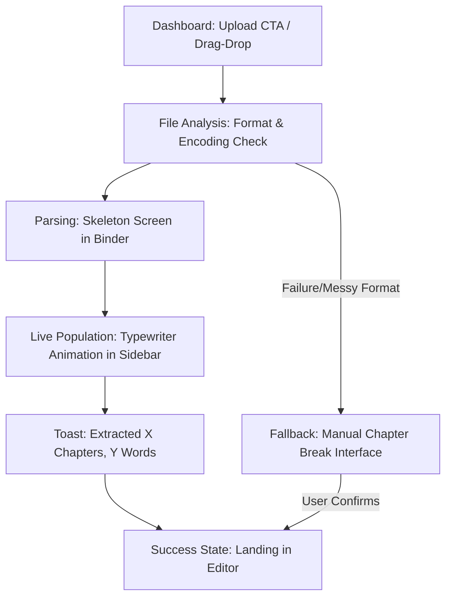
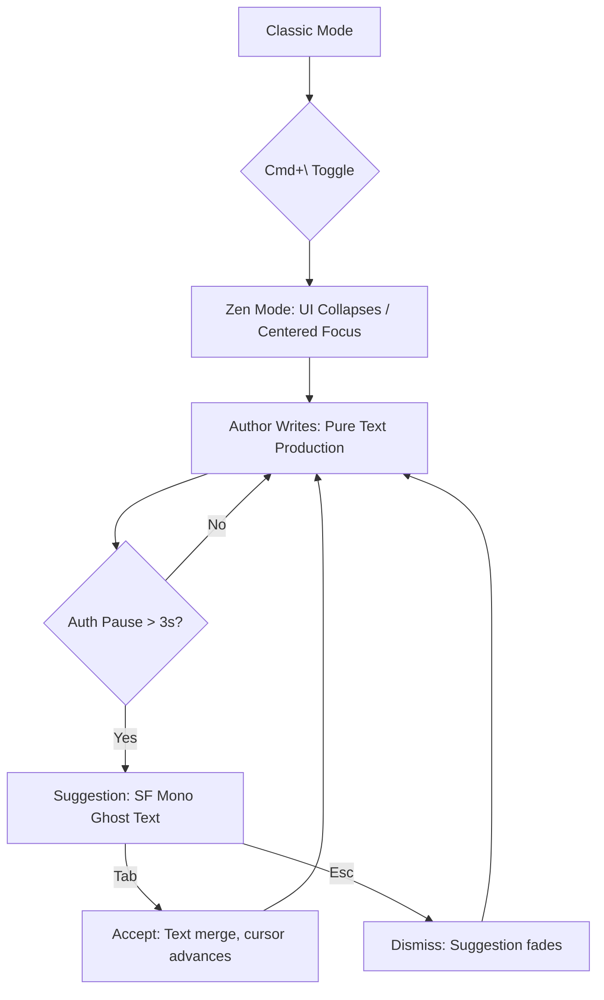
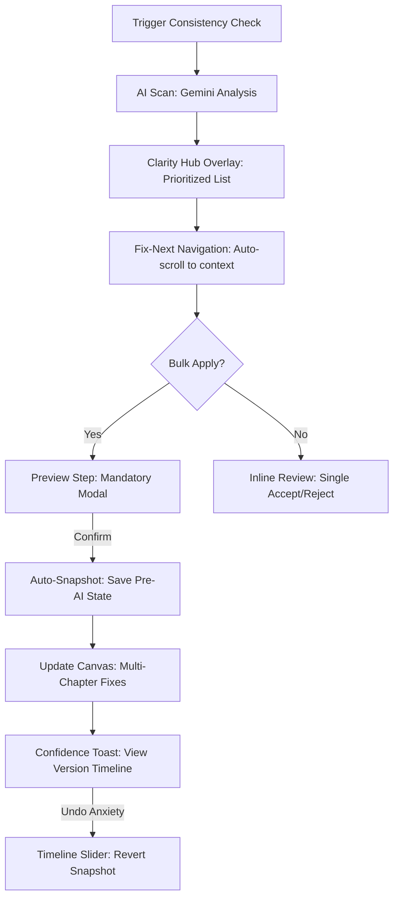

# UX Design Specification bearing-app

**Author:** Ryanf
**Date:** 2025-12-28T23:23:46-05:00

---

## Executive Summary

### Project Vision
**The Bearing** is a premium, web-based self-publishing environment that empowers authors to transform raw ideas into publish-ready manuscripts. By blending a distraction-free writing experience with "writer-in-the-loop" AI assistance, it ensures that technology serves the author's unique voice rather than replacing it. It is built on a foundation of trust, predictable pricing, and absolute data reliability.

### Target Users
- **The Modern Indie-Pubber**: Tech-fluent authors (Scrivener/Vellum users) looking for a streamlined, cloud-native alternative that handles consistency and edits without the overhead of complex desktop software.
- **The Aspiring Hobbyist**: New writers who need an intuitive, "just works" interface that guides them from their first word or their first messy Word doc upload to a professional result.

### Key Design Challenges
- **The "Invisible" AI Assistant**: Implementing Llama suggestions as subtle ghost text that facilitates flow without feeling like a "spell-check" interruption.
- **Cognitive Load in Correction**: Presenting complex Gemini consistency reports in a way that feels like a helpful checklist rather than an overwhelming list of errors.
- **Conversion Confidence**: Crafting a "First Run" experience that makes uploading a messy DOCX feel safe and accurate, with clear feedback on how it’s being converted into the platform's native format.

### Design Opportunities
- **Flow-State AI**: Using manual triggers and subtle inline prompts to create a "Power User" writing environment where the AI is only as loud as the author wants it to be.
- **Decision-First Editing**: Creating a "Review and Adjust" interface that prioritizes author agency, offering "one-click rewrites" as suggestions to be evaluated rather than automated fixes.
- **Predictable Transparency**: Turning "metering and caps" from a friction point into a trust-building feature through clear, writer-friendly usage visualizations.

---

## Core User Experience

### Defining Experience
The heart of **The Bearing** is the **Secure, Always-Synced Canvas**. Every interaction orbits the act of writing, ensuring the author feels their work is protected, analyzed, and organized without ever being interrupted. The experience is defined by a "zero-friction" editor where AI-driven insights are a secondary layer that the author can toggle on demand.

### Platform Strategy
- **Adaptive Web-First**: Primarily a desktop-optimized web application for intensive writing sessions, with a **responsive mobile layout** specifically tailored for "on-the-go-review" of AI suggestions and consistency reports.
- **Always-Current Cloud**: A strictly cloud-based workflow that prioritizes real-time synchronization over offline capabilities, ensuring the latest version is available on any device.
- **Standardized Control**: Prioritization of standard keyboard shortcuts (Ctrl+B, Ctrl+Z) to ensure the editor feels immediately familiar to users coming from Word or Google Docs.

### Effortless Interactions
- **The Magic Ingest**: A "one-drop" upload system where raw DOCX, PDF, or Markdown files are instantly converted into a navigable, chapter-based structure.
- **Context-Aware Toggles**: A seamless transition between "Writing Mode" (distraction-free) and "Review Mode" (AI-assisted) that preserves cursor position and cognitive focus.
- **The "Safety Net"**: A non-negotiable 3-second autosave heartbeat that eliminates the "Save" button as a concept.

### Critical Success Moments
- **The Consistency Reveal**: The moment an author runs a deep check on a 50k+ word manuscript and sees an actionable, high-level map of their narrative consistency.
- **The Multi-Device Hand-off**: Writing a chapter on desktop and later reviewing Llama suggestions on a phone without any layout friction.

### Experience Principles
- **Writing is Primary**: The AI exists to serve the text, not the other way around. Suggestions are subtle and never obstructive.
- **Trust via Transparency**: If a save fails or a limit is hit, the user is informed immediately and gently. Data loss is the ultimate failure.
- **Organization by Default**: The system handles the "management" of manuscripts (chapters, versions, exports) so authors can handle the "creation".

---

## Desired Emotional Response

### Primary Emotional Goals
The North Star for **The Bearing** is **Author Agency**. Users should feel **powerful and in control** of their narrative, maintaining a state of **calm focus** during production. The technology should feel like a high-end instrument—responsive, precise, and entirely subordinate to the author’s creative will.

### Emotional Journey Mapping
- **Discovery**: "This is a serious, premium space for my work. I trust this environment."
- **Core Action (Writing)**: "I am in flow. The tool is an extension of my mind; the AI only speaks when I need it."
- **Completion (Check & Review)**: "I see my manuscript clearly now. I feel empowered to make it better without losing my voice."
- **Error/Boundary States**: "Everything is transparent. I am being treated fairly, and my data is safe."

### Micro-Emotions
- **Confidence**: Replaces the "fear of the messy upload" with an instant, organized preview of the manuscript.
- **Trust**: Anchored in the precision of the Gemini checks. The author doesn't just see "errors"; they see actionable plot and character insights they can verify.
- **Value-Excitement**: Transforming "token caps" from a source of anxiety into a clear visualization of the massive compute-value the platform is providing.

### Design Implications
- **Control → Agency-Driven UI**: AI suggestions appear as non-blocking ghost text; manual review is the default for consistency checks.
- **Trust → Visual Verifiability**: Every AI insight should be easy to cross-reference with the text, building a "trust-but-verify" relationship.
- **Fairness → Transparent Metering**: A clear, aesthetically pleasing usage dashboard that removes the "mystery" of AI costs.

### Emotional Design Principles
- **Author-First, AI-Second**: Design for the human ego first. The AI is a researcher and editor, not the writer.
- **Precision Builds Trust**: Vague feedback creates skepticism; specific, evidence-based reports build professional trust.
- **Transparency over Mystery**: No silent processes. If the AI is thinking, save is occurring, or a cap is near, show it with elegance.

---

## UX Pattern Analysis & Inspiration

### Inspiring Products Analysis
- **Scrivener**: The master of **Information Hierarchy**. We take inspiration from its "Binder" sidebar for chapter and research management, but reject its "90s cockpit" complexity.
- **Google Docs**: The gold standard for **Sync Trust and Transparency**. We adopt its non-destructive "Suggesting Mode" and its "It just works" cloud reliability.
- **Ulysses**: The benchmark for **Typographic Focus**. We leverage its "Typewriter Mode" and "Liquid Glass" transitions to ensure the editor feels sophisticated and calm.
- **Sudowrite**: The pioneer of **AI flow**. We lean into its "Story Bible" concept for consistency and its "Focus Mode" to keep AI secondary to the creative process.

### Transferable UX Patterns
- **The "Binder" Navigation (from Scrivener)**: A hierarchical sidebar for jumping between chapters and scenes without losing context.
- **"Suggesting Mode" Rewrites (from Docs)**: AI suggestions that appear as reversible, inline ghost text, ensuring the author always has the final veto.
- **Typewriter Canvas (from Ulysses)**: Centered, distraction-free writing area with subtle progress indicators.
- **Snapshot Versioning (from Scrivener/Docs)**: "Save-on-demand" versioning (Snapshots) alongside our 3-second autosave heartbeat.

### Anti-Patterns to Avoid
- **"90s Cockpit" UI**: We avoid overwhelming the author with hundreds of visible buttons and settings.
- **Blank Canvas Paralysis**: We reject the "Notion-style" setup burden. The user should be writing or reviewing within seconds of login.
- **Markdown-Only Friction**: While we support tech-fluent users, our editor must be **Full WYSIWYG** to remain accessible to Word/Docs users.
- **Manual Sync Loops**: We eliminate "Save" buttons and manual upload/download cycles; the cloud is the single source of truth.

### Design Inspiration Strategy
- **Adopt**: The chapter navigator, non-destructive AI prompts, and distraction-free writing mode.
- **Adapt**: Convert complex "Compile" settings into a "One-Click Magic Export"; modernize the "Binder" sidebar with a sleek, minimalist design.
- **Unique Edge**: The **"Consistency Dashboard"**—a central, actionable hub that translates deep AI analysis into a simple, high-confidence checklist for the author.

---

## Design System Foundation

### Design System Choice
**Shadcn/UI + Tailwind CSS + Radix UI Primitives**
The project will utilize a "Headless + Themeable" approach, leveraging Radix UI for accessible primitives and Tailwind CSS for utility-first styling. This aligns perfectly with the stack specified in the PRD (Next.js/Tailwind) while providing a more modern, customizable component layer than traditional libraries.

### Rationale for Selection
- **Speed to Canvas**: Shadcn/UI allows for the immediate implementation of the "Secure Canvas" through copy-paste components that are already optimized for Next.js and Tailwind.
- **Premium Customization**: Unlike Material or Ant Design, Shadcn/UI gives us full control over the source code of each component, permitting the "Ulysses-level" typographic polish and subtle interactions required for a distraction-free editor.
- **Accessibility & Reliability**: Radix UI primitives ensure that decimal components (like the chapter sidebar and consistency dialogs) are high-performance and accessible by default.
- **Solo-Developer Efficiency**: The "copy-paste" model reduces the maintenance burden of a heavy library while keeping the codebase lightweight and understandable.

### Implementation Approach
- **Typography-First**: Immediate configuration of `@tailwindcss/typography` to handle the rich-text rendering in the editor.
- **Component Evolution**: Start with base Shadcn components (Sidebar, Dialog, Tooltip) and evolve them into specialized Bearing patterns (The Binder, The Canvas, The Hub).
- **Glassmorphism & Micro-animations**: Layering custom CSS variables onto the Shadcn theme to achieve the "Liquid Glass" effect inspired by Ulysses.

### Customization Strategy
- **Thematic Core**: Establishing a "Calm/Focus" dark mode and a "Paper/Ink" light mode.
- **Agency-Driven UI**: Customizing interaction states (hover, focus) to be subtle and non-intrusive, supporting the "AI is secondary" principle.

---

## Detailed Core Experience

### Defining Experience: The Clarity Reveal
The defining moment of **The Bearing** is the transition from raw text to an actionable **Narrative Map**. When an author triggers a consistency check, the system acts as a "Plot Detective," surfacing character contradictions, timeline slips, and world-building gaps into a structured, navigable checklist. It transforms manual cross-referencing into a single, high-confidence overview.

### User Mental Model
- **The "External Bible" Workaround**: Modern authors currently supplement their editors with separate spreadsheets and manual notes. **The Bearing** internalizes this model as live metadata in the sidebar.
- **The Fear of Inconsistency**: Authors live with anxiety over "unseen errors." Visual "Consistency Badges" (🔴) in the Binder signal when issues are detected, providing immediate reassurance.

### Success Criteria
- **Actionable Insight**: Fixing a multi-chapter plot hole in three clicks (Identify → Preview → Apply).
- **Zero Context Switching**: Managing character lists and AI reports without leaving the manuscript view.
- **Invisible Continuity**: Automatic chapter detection upon upload; organized-by-default view.

### Novel UX Patterns
- **Consistency Badges**: Visual signals in the chapter sidebar that indicate narrative issues.
- **Pause-Detection Suggestions**: Ghost text that appears ONLY after 3 seconds of idle time to avoid flow interruption.
- **Cmd+K "Commander"**: Search bar metaphor for AI-powered manuscript transformations (e.g., "Change tone to dark").

### Experience Mechanics
- **The Binder**: Drag-and-drop reorganization, live word counts, and automatic file parsing.
- **The Canvas**: Pure typing environment, 3s idle-state suggestions, and subtle status feedback ("Saved 2s ago").
- **The Hub**: Action center with **Inline Diff Previews** for suggested fixes, allowing single-click application or bulk rejection.

---

## Visual Design Foundation

### Color System
**Theme: "Modern Parchment"**
A professional, low-strain palette designed for multi-hour writing sessions. It prioritizes warmth and clarity, using soft, organic hues to minimize eye fatigue.
- **Surface**: `#FDF7E9` (Warm off-white/Parchment)
- **Primary Text**: `#1F2937` (Dark Slate for high legibility)
- **Secondary UI**: `#6B7280` (Soft gray for non-intrusive metadata)
- **Accent/Action**: `#4F46E5` (Indigo for subtle focus and calls-to-action)
- **Semantic Mappings**:
  - AI Suggestion: Soft amber or indigo glow to signal "thought."
  - Consistency Warning: Subtle red crimson (🔴) for the Binder badges.

### Typography System
**Strategy: "Classic & Academic"**
A dual-typeface approach that pairs the traditional authority of a serif font with the clean focus of modern sans-serif.
- **Manuscript Canvas**: **Merriweather** (Serif). Chosen for its high legibility and "book-like" immersion, making the digital canvas feel like a physical page.
- **Interface/UI**: **Inter** (Sans-serif). A modern, neutral workhorse that keeps the "Binder" and "Hub" controls clear and legible at smaller sizes.
- **AI Ghost Text**: **SF Mono** (Monospace). Creates a subtle "machine-origin" distinction for AI suggestions, ensuring the author's voice and the system's thoughts are visually separated.

### Spacing & Layout Foundation
- **Strategy: Airy & Spacious (Ulysses-style)**. Every element is given "room to breathe" to reduce cognitive load and facilitate deep work.
- **Canvas Layout**: **Centered Fixed-Width**. The writing area is locked to a readable width of 65-75 characters per line to optimize eye tracking.
- **Sidebar (The Binder)**: Collapsible to zero-width to allow a pure "Full Screen" focus mode.
- **Base Unit**: 4px/8px grid system for consistent component relationships.

### Accessibility Considerations
- **Contrast Ratios**: All text pairings (Merriweather on Parchment) are tested to meet WCAG AA standards.
- **Visual Signals**: Consistency warnings (Badges) use both color and icons (dots/symbols) to ensure information is perceivable for color-blind users.
- **Dynamic Scale**: Users can adjust the Canvas font size without breaking the centered layout.

---

## Design Direction Decision

### Design Directions Explored
We explored four distinct visual directions:
- **Classic**: A typography-first approach emphasizing legibility and traditional book aesthetics.
- **Zen Flow**: An ultra-minimalist focus mode that removes all UI clutter to prioritize the writing canvas.
- **Detective**: A management-focused view that integrates the "Clarity Hub" for deep narrative analysis.
- **Modern UI**: A clean, high-tech variation using sans-serif typography on a white background.

### Chosen Direction
**"The Multi-Modal Detective"**
The final direction is a hybrid that defaults to the powerful **Detective Mode** for information density and narrative management, but allows the user to instantly toggle into **Zen Mode** for an unobstructed writing experience.

### Design Rationale
- **Flexible Agency**: Users can switch between "Management Mode" (Clarity Hub visible) and "Focus Mode" (Zen Canvas) depending on their current creative task.
- **Superior Legibility**: Adoption of the **Classic Mode** typographic stack (Merriweather Serif on Modern Parchment) as the global writing standard, providing the most immersive and comfortable long-form reading experience.
- **Writer-in-the-Loop AI**: Ghost text remains the primary interaction pattern for AI suggestions, appearing in distinct SF Mono to maintain a clear but non-disruptive boundary between human and machine voices.

### Implementation Approach
- **Global Themes**: Implementation of a "Parchment" theme as the primary interface color, with a toggleable "Focus Mode" that collapses both the Binder and the Hub.
- **Component States**: UI elements will support "Hover-to-Reveal" in Zen mode to ensure speed without clutter.

---

## User Journey Flows

### Journey: The Magic Ingest
The high-friction moment of uploading a document is transformed into a celebratory "Magic Moment" where chaos becomes order.

### Journey: The Zen-Flow Writing Cycle
A deep-work cycle designed to minimize cognitive load and maximize creative momentum.

### Journey: The Clarity Reveal
The investigation phase where AI transforms from a "co-writer" into a "story detective."

### Journey Patterns
- **Typewriter Population**: Using animations to signify background "work" feels faster and more transparent to the user than a static loading spinner.
- **Ghost Transition**: Standardizing `Tab` for AI acceptance across both the Canvas (Llama) and the Hub (Gemini fixes).
- **Haptic Status**: Subtle visual-haptic feedback (fades and glows) to confirm "Autosave" without distracting the author.

### Flow Optimization Principles
- **Escape Hatches by Default**: Every AI-driven action includes a manual secondary path (e.g., manual chapter breaking or manual plot notation).
- **Git-like Confidence**: A "Snapshot Before Fix" philosophy that ensures authors never fear "Bulk Apply" or destructive AI edits.
- **Context Preservation**: Every consistency fix and chapter jump preserves the author’s scroll position and cursor focus.

---
## Component Strategy

### Design System Components

The project leverages **Shadcn/UI + Radix UI Primitives** as its foundation components. This provides a robust, accessible library of standard elements:
- **Accordion**: Powering the collapsible issue groups in the Clarity Hub.
- **TreeView**: The structural base for the hierarchical Binder.
- **Slider**: Implementing the "Time-Travel" snapshot revert in the Hub.
- **Cards & Dialogs**: Providing the container logic for the Usage Dashboard, Service Marketplace, and Export Previews.

### Custom Components

Three critical, PRD-specific components will be developed from scratch to serve as product differentiators:

#### Component: The Secure Canvas
- **Purpose**: A high-performance, distraction-free writing environment optimized for "writer-in-the-loop" AI integration.
- **Stack**: TipTap / ProseMirror core.
- **Anatomy**: Absolute-positioned **Ghost Text Overlay** (SF Mono) for Llama suggestions and a subtle Status Ticker for "3s Heartbeat" autosave feedback.
- **Interaction**: `Cmd+\` for Zen Mode (Ulysses-style); `Tab` to merge AI suggestions; `Esc` to dismiss.

#### Component: The Multi-Modal Binder
- **Purpose**: Hierarchical manuscript and research management with live narrative metadata.
- **Anatomy**: Hierarchical tree extended from Shadcn with **Live Metadata Badges** (🔴/🟡), word count pills, and drag-and-drop reordering.
- **Interaction**: Badge-click triggers auto-scroll in the Canvas to the context of the issue and opens the relevant card in the Hub.

#### Component: The Clarity Hub
- **Purpose**: A centralized action center for reviewing and applying deep narrative consistency fixes.
- **Anatomy**: Prioritized issue cards (Critical➔Minor), an inline **Monospace Diff View** for change previews, and the **Snapshot Timeline Slider**.
- **Interaction**: "Fix Next" wizard for sequential correction; "Bulk Apply" with a mandatory preview and auto-snapshot modal.

#### Additional Specialized Components:
- **Usage Metering Dashboard**: Visual progress bars and token consumption visualizations.
- **Service Marketplace Cards**: Hover➔Request interaction for ISBN and cover services.
- **Export Preview Modal**: WYSIWYG modal for KDP-ready format validation (PDF/Epub).

### Component Implementation Strategy
- **Visual Consistency**: All custom components are styled using the **"Modern Parchment"** tokens (Merriweather, Inter, SF Mono) to ensure a premium feel.
- **Accessibility & Flow**: Keyboard shortcuts are prioritized for the Canvas and Hub to maintain author momentum.
- **Differentiator Focus**: Custom engineering is strictly focused on the "Signature Interactions" (Canvas, Binder, Hub) while standard components are used for utility pages.

### Implementation Roadmap
- **Phase 1 (MVP Foundation)**: **Secure Canvas** + **The Binder**. Focuses on the core writing and organization experience.
- **Phase 2 (Value Validation)**: **Clarity Hub** + **Usage Metering**. Validates the AI consistency ROI and transparency.
- **Phase 3 (Publication & Growth)**: **Service Marketplace** + **Export Preview**. Polishes the final stage of the author's journey.

---
## UX Consistency Patterns

### Action Hierarchy

We use a strict visual hierarchy to distinguish between creative, system, and management actions.
- **Primary (Indigo Solid):** Reserved for high-value progression steps. Examples: *Run Consistency Check*, *New Manuscript*, *Export*.
- **Secondary (Indigo Ghost/Outline):** For supporting creative actions. Examples: *Add Scene*, *Save Snapshot*.
- **Tertiary (Gray Ghost):** For administrative and utility tasks. Examples: *Settings*, *Help*.
- **Interaction:** All primary actions support keyboard discoverability (tooltips show shortcuts on hover).

### AI Feedback Patterns

Consistency in how the system "thinks" and "responds" builds trust and reduces anxiety.
- **Thinking State:** Pulsing indigo skeleton screens in the Clarity Hub with a descriptive subtitle (e.g., *"Analyzing plot threads..."*). **Blocking spinners are forbidden.**
- **Success State:** A 150ms indigo glow on affected text + a "Saved · 1s" ticker in the status bar. Replicates the confidence of Google Docs suggesting mode.
- **Error State:** Non-blocking inline crimson badges with an immediate *"Revert to Snapshot"* escape hatch.

### Navigation & Sidebar Persistence

The interface adapts to the device while maintaining the "Binder" metaphor.
- **Desktop:** Persistent left sidebar (20% width) for the Binder. `Cmd+B` toggles visibility (Ulysses-style).
- **Mobile:** Bottom tab bar for primary navigation (Binder/Canvas/Hub) that triggers a swipe-up overlay for detailed management.
- **Context Preservation:** Zero-page-reload architecture. Switching chapters or opening the Hub never loses the author's scroll position or cursor focus.

### Empty & Loading States

- **First Run (Magic Ingest):** A full-screen dropzone with a centered Merriweather quote: *"Your manuscript awaits its structure."* Encourages immediate action over setup friction.
- **AI Processing:** Uses live metrics in skeleton cards (e.g., *"Scanned 23k words..."*) to visualize the massive background compute being provided to the author.

### Modal & Overlay Logic

- **Full-Screen Modals:** Reserved for high-stakes, final-state actions (*Export Preview*, *Bulk Apply Confirmation*).
- **Right Slide-Over (The Hub):** Provides a "context-pair" view where the Hub sits alongside the text without overlapping it.
- **Ghost Text (Inline Overlay):** Absolute positioned subtle text for Llama suggestions, triggered by the 3s pause-detection.

## Responsive Design & Accessibility

### Responsive Strategy

**The Bearing** adopts a "Production-on-Desktop, Review-on-Mobile" philosophy, ensuring that while the full writing suite is always available, the interface optimizes for the task most common on each device.

- **Desktop (Production Hub):** A full 3-column layout (Binder | Canvas | Hub). Extra screen real estate is used for "Zen Gutters" to maintain the optimal 75-character line length while providing a centered, stable writing plane.
- **Tablet (Context Aware):** The Binder becomes collapsible; the Canvas remains centered, and the Clarity Hub is handled as a touch-optimized slide-over.
- **Mobile (Review & Triage):** A bottom tab bar provides primary navigation between the Binder, Canvas, and Hub. Sidebars are transformed into swipe-up overlays for rapid review of AI suggestions and consistency warnings.

### Breakpoint Strategy

- **Mobile (< 768px):** Single column, bottom menu, high-contrast buttons, and minimized margins for maximum text visibility.
- **Tablet (768px - 1024px):** Hybrid view with a collapsible sidebar and touch-friendly targets.
- **Desktop (> 1024px):** Full expanded environment with persistent sidebars and secondary production tools.

### Accessibility Strategy (WCAG AA)

We prioritize inclusive design to ensure that all authors, regardless of ability, can maintain their creative flow.

- **Visual Clarity:** All "Modern Parchment" themes are verified for a **4.5:1 contrast ratio**. We provide high-contrast overrides and respect the `prefers-reduced-motion` browser setting.
- **Keyboard Mastery:** Full keyboard navigation support (`Tab`, `Esc`, `Cmd+K`) with high-visibility focus indicators. Screen readers are prioritized through semantic HTML, ensuring each chapter is wrapped in an `<article>` tag.
- **Assistive Technologies:** 
  - **Voice-to-Text:** Prioritized Canvas dictation support for authors with RSI or mobility issues.
  - **Voice Commands:** Implementation of the Cmd+K "Commander" with voice-activation hooks.
  - **Touch Targets:** Minimum **44x44px** targets on all touch-based platforms.

### Testing & Implementation Strategy

- **Automation:** Integrated Axe-core audits via Playwright for every core route.
- **Manual Validation:** Regular testing with MacOS VoiceOver and iOS/Android screen readers.
- **Scalable UI:** Use of `rem` for all typography to support system-level zoom without layout breakage.

---
 equity
